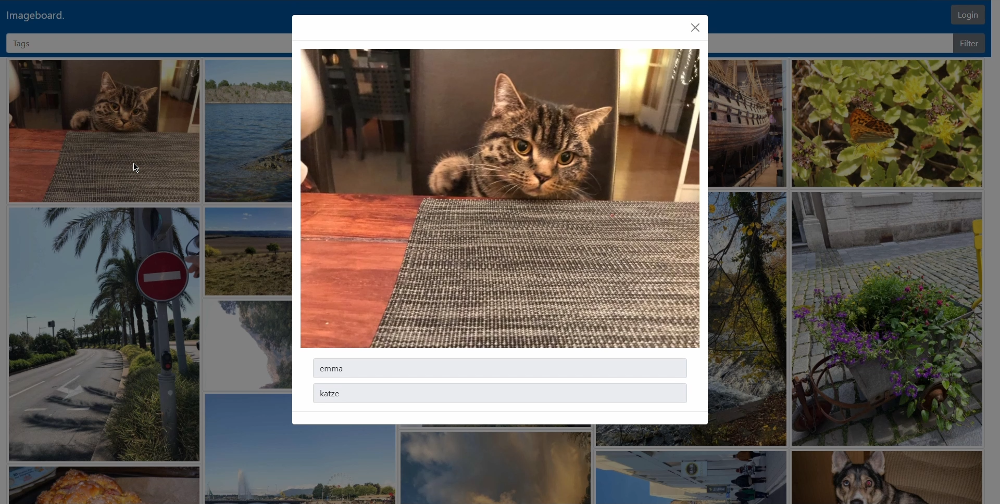

# Imageboard

A modern full-stack web application for managing and sharing images developed by a team of 4 students. It features a responsive Angular single-page interface, an Express.js REST API, and MongoDB for data storage. The platform supports secure user authentication (JWT), image uploads with automatic thumbnail generation, and containerized deployment via Docker Compose — making it easy to demo, scale, or extend.




## Setup

You need the Angular cli installed for executing the scripts.
Run `npm install` in angular-client, backend and in the root folder of this project. (in sum 3 times)
Read below for Mongodb setup and docker compose.

## Start production server

First you need to setup the project described in the `Setup` section of this readme.
Run `npm run start` for prod build and start of backend server.

## Build

Run `npm run build` to build the project(also included in `npm run start`).  
Run `npm run ng:build` to build the angular-client(also included in `npm run start`).  

## MongoDB Initialization

Run `mongod --dbpath data` to start a mongodb process (instead of `data` you can use a user-defined path where you want to store the database).  
Run `mongo` to start the mongo shell.  
Create the database with `use imageboard` in the mongo shell.  

## Setup Using Docker Compose

A Sample `docker-compose.yml` is included as follows:
 ```yaml
 version: '2'

 services:
   mongo-db:
     image: mongo
     restart: unless-stopped

   server:
     build: .
     depends_on: ["mongo-db"]
     restart: unless-stopped
     ports:
       - "3000:3000"
     links:
       - mongo-db
     volumes:
       - /app/images
 ```
Run `docker-compose up --detach` to build and start the project
